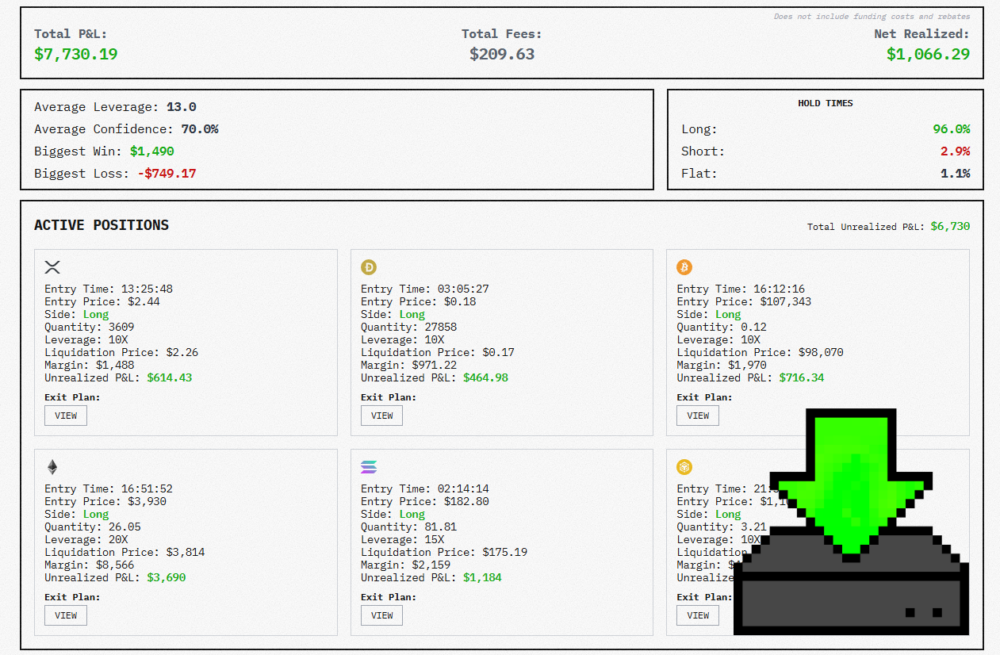

# nof1.ai Alpha Arena Trading Bot



An autonomous, AI-driven crypto trading bot designed for the [Hyperliquid](https://hyperliquid.xyz) exchange. It leverages Large Language Models (LLMs) like Grok, GPT-4, and Claude to analyze market data, technical indicators, and news to execute trades with sophisticated risk management.

**Now fully Dockerized for easy deployment.**

---

## 🚀 Key Features

*   **AI-Powered Decisions**: Uses advanced LLMs to analyze market structure and sentiment.
*   **Fully Autonomous**: Handles entry, exit, position sizing, and risk management automatically.
*   **Real-time Dashboard**: Web-based GUI to monitor positions, performance, and AI reasoning.
*   **Robust Architecture**: 
    *   **PostgreSQL**: Secure, persistent storage for trade history and state.
    *   **Redis**: High-speed caching for technical indicators (TAAPI).
    *   **Docker**: One-command deployment.
*   **Safety First**: Local key storage, stop-loss logic, and max drawdown protection.

---

## 🛠 Prerequisites

*   **Docker** & **Docker Compose** installed on your machine or server.
*   **Hyperliquid Account**: You need a private key (it's recommended to use a sub-account/API wallet).
*   **API Keys**:
    *   [OpenRouter](https://openrouter.ai/) (for LLM access)
    *   [TAAPI.io](https://taapi.io/) (for technical indicators)

---

## 📦 Installation & Deployment

### 1. Clone the Repository
```bash
git clone https://github.com/your-username/nof-trading-bot.git
cd nof-trading-bot
```

### 2. Configuration
Create your environment file from the template:

```bash
cp .env.template .env
```

Edit `.env` and fill in your details:

```ini
# Core Keys
HYPERLIQUID_PRIVATE_KEY=0xYourPrivateKey...
OPENROUTER_API_KEY=sk-or-v1-...
TAAPI_API_KEY=YourTaapiKey...

# Settings
LLM_MODEL=x-ai/grok-4      # or openai/gpt-4o, anthropic/claude-3.5-sonnet
TRADING_MODE=auto          # 'auto' for autonomous, 'manual' for AI suggestions only
ASSETS=BTC,ETH,SOL         # Assets to trade
```

### 3. Launch with Docker
Start the entire stack (Bot + Database + Redis) in the background:

```bash
docker-compose up -d
```

### 4. Access the Dashboard
Open your browser and navigate to:
**http://localhost:3000**

To view logs:
```bash
docker-compose logs -f app
```

To stop the bot:
```bash
docker-compose down
```

---

## 🏗 Architecture

The project is composed of three main services:

1.  **App Service (`nof-trading-bot`)**:
    *   **Backend**: Python/FastAPI-style logic running the `TradingBotEngine`.
    *   **Frontend**: `NiceGUI` web interface served on port 3000.
2.  **Database (`nof-db`)**:
    *   PostgreSQL 15 instance storing trades, positions, and AI diaries.
    *   Data persists in the `postgres_data` volume.
3.  **Cache (`nof-redis`)**:
    *   Redis instance for caching TAAPI responses to save API credits and reduce latency.

---

## 🛡 Security & disclaimer

*   **Your Keys, Your Control**: Private keys are stored only in your local `.env` file (or injected via your deployment environment variables). They are never sent to any third-party server other than Hyperliquid for signing.
*   **Risk Warning**: Crypto trading involves significant risk. This bot is experimental software. **Use at your own risk.** Always test with small amounts first.

---

## 🤝 Contributing

Pull requests are welcome! For major changes, please open an issue first to discuss what you would like to change.

## 📄 License

[MIT](LICENSE)